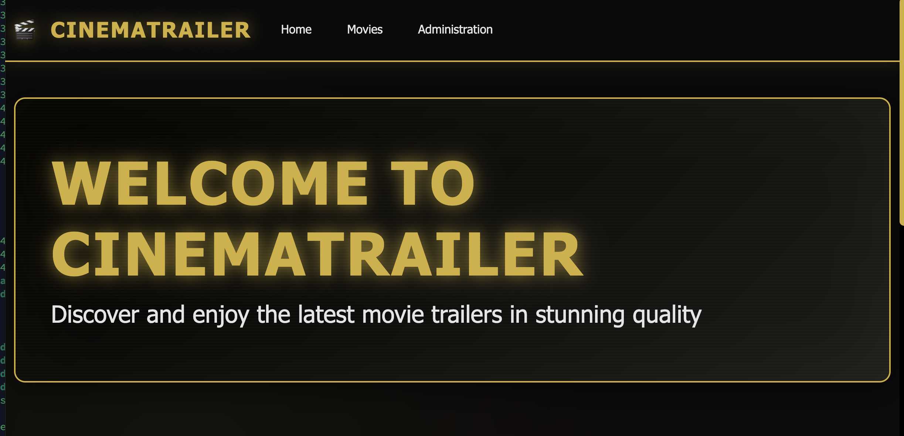
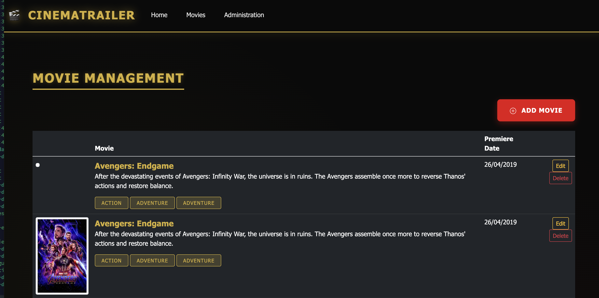
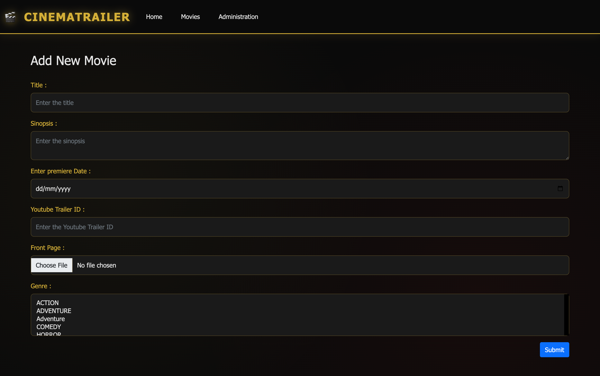

# Movie Trailer Application

A modern Spring Boot web application for managing and showcasing movie trailers with YouTube integration and real-time
poster images from TMDB CDN.







## Table of Contents

- [Overview](#overview)
- [Features](#features)
- [Tech Stack](#tech-stack)
- [Prerequisites](#prerequisites)
- [Installation](#installation)
- [Running the Application](#running-the-application)
- [Database Setup](#database-setup)
- [Testing](#testing)
- [Project Structure](#project-structure)
- [API Endpoints](#api-endpoints)
- [Docker Deployment](#docker-deployment)
- [CI/CD Pipeline](#cicd-pipeline)
- [Configuration](#configuration)
- [Troubleshooting](#troubleshooting)
- [Contributing](#contributing)
- [License](#license)

## Overview

Movie Trailer is a full-featured web application that allows users to browse, search, and watch movie trailers.
Administrators can manage movies, genres, and upload cover images through an intuitive admin panel. The application
features:

- Public-facing movie catalog with pagination
- Integrated YouTube trailer player
- Admin panel for CRUD operations
- Real TMDB movie poster integration
- Responsive Thymeleaf templates
- RESTful API endpoints
- Production-ready CI/CD pipeline

## Features

### User Features

- Browse movie catalog with pagination
- View movie details (synopsis, premiere date, genres)
- Watch trailers directly from YouTube
- Filter movies by genre
- Responsive design for mobile and desktop

### Admin Features

- Create, read, update, and delete movies
- Manage genres
- Upload movie cover images
- Set YouTube trailer IDs
- Bulk data management through Flyway migrations

### Technical Features

- RESTful API with Swagger documentation
- Database migrations with Flyway
- File upload handling for movie posters
- Testcontainers integration testing
- Docker containerization
- GitLab CI/CD pipeline with automatic deployments
- Health check endpoints (Spring Boot Actuator)

## Tech Stack

### Backend

- **Java 25** - Latest Java LTS version
- **Spring Boot 3.5.7** - Application framework
- **Spring Data JPA** - Database ORM
- **Hibernate 6.6** - JPA implementation
- **PostgreSQL 18.0** - Primary database
- **Flyway** - Database migration tool
- **Lombok** - Boilerplate code reduction

### Frontend

- **Thymeleaf** - Server-side template engine
- **HTML5/CSS3** - Modern web standards
- **JavaScript** - Client-side interactions

### Build & Deployment

- **Maven 3.9** - Build automation
- **Docker** - Containerization
- **Jib Maven Plugin** - Containerization without Docker daemon
- **GitLab CI/CD** - Continuous integration and deployment
- **Docker Compose** - Multi-container orchestration

### Testing

- **JUnit 5** - Unit testing framework
- **Testcontainers 1.20.4** - Integration testing with real PostgreSQL
- **AssertJ** - Fluent assertions
- **Spring Boot Test** - Testing utilities

## Prerequisites

Before you begin, ensure you have the following installed:

- **Java 25** or higher ([Download](https://adoptium.net/))
- **Maven 3.9+** ([Download](https://maven.apache.org/download.cgi))
- **Docker Desktop** ([Download](https://www.docker.com/products/docker-desktop))
- **Git** ([Download](https://git-scm.com/downloads))
- **PostgreSQL 18** (Optional - Docker Compose will handle this)

### Recommended IDEs

- IntelliJ IDEA Ultimate/Community Edition
- Visual Studio Code with Java extensions
- Eclipse IDE for Java Developers

## Installation

### 1. Clone the Repository

```bash
git clone https://github.com/hendisantika/movie-trailer.git
cd movie-trailer
```

### 2. Start PostgreSQL Database

Using Docker Compose (Recommended):

```bash
docker-compose up -d
```

This will start:

- PostgreSQL 18.0 on port **5433**
- Database name: `movie_trailers`
- Username: `yu71`
- Password: `53cret`

### 3. Build the Application

```bash
mvn clean install
```

### 4. Run Database Migrations

Flyway migrations run automatically on application startup. The initial migration includes:

- Database schema creation
- 8 genres (Action, Drama, Comedy, Thriller, Sci-Fi, Romance, Horror, Adventure)
- 10 popular movies with real TMDB posters and YouTube trailers

## Running the Application

### Option 1: Using Maven (Development)

```bash
mvn spring-boot:run
```

### Option 2: Using JAR file

```bash
mvn clean package
java -jar target/movie-trailer-0.0.1-SNAPSHOT.jar
```

### Option 3: Using Docker

```bash
# Build Docker image
docker build -t movie-trailer:latest .

# Run container
docker run -d \
  --name movie-trailer-app \
  -p 8080:8080 \
  -e SPRING_DATASOURCE_URL=jdbc:postgresql://host.docker.internal:5433/movie_trailers \
  -e SPRING_DATASOURCE_USERNAME=yu71 \
  -e SPRING_DATASOURCE_PASSWORD=53cret \
  movie-trailer:latest
```

### Accessing the Application

Once started, the application will be available at:

- **Main Application**: http://localhost:8080
- **Admin Panel**: http://localhost:8080/admin
- **API Documentation**: http://localhost:8080/swagger-ui.html
- **Health Check**: http://localhost:8080/actuator/health

## Database Setup

### Automatic Setup (Recommended)

The application uses Flyway for automatic database migrations. On first startup, it will:

1. Create all necessary tables (movie, genre, genre_movie)
2. Insert 8 genres
3. Insert 10 popular movies with:
    - Real TMDB poster URLs
    - YouTube trailer IDs
    - Proper genre associations

### Manual Database Inspection

```bash
# Connect to PostgreSQL container
docker exec -it postgres-movie-trailers psql -U yu71 -d movie_trailers

# List all movies
SELECT id, title, premiere_date FROM movie;

# List all genres
SELECT * FROM genre;

# Check migration history
SELECT * FROM flyway_schema_history;
```

### Database Schema

**movie** table:

```sql
- id (integer, primary key, auto-increment)
- title (varchar, not null)
- sinopsis (varchar, not null)
- premiere_date (date, not null)
- youtube_trailer_id (varchar, not null)
- route_cover (varchar)
```

**genre** table:

```sql
- id (integer, primary key)
- title (varchar)
```

**genre_movie** junction table:

```sql
- movie_id (integer, foreign key)
- id_genre (integer, foreign key)
```

## Testing

### Run All Tests

```bash
mvn clean test
```

### Test Coverage

The project includes **15 comprehensive tests**:

**GenreRepositoryTest** (7 tests):

- Save and retrieve genre
- Find genre by ID
- Find all genres
- Update genre
- Delete genre
- Count genres
- Check if genre exists

**MovieRepositoryTest** (6 tests):

- Save and retrieve movie with genres
- Find movie by ID
- Find all movies
- Update movie
- Delete movie
- Count movies

**MovieTrailerApplicationTests** (2 tests):

- Context loads successfully
- Database connection is valid

### Integration Testing

The project uses **Testcontainers** for integration testing with a real PostgreSQL database:

```java
// Automatically managed PostgreSQL container
PostgreSQLContainer<?> postgres = new PostgreSQLContainer<>("postgres:18.0-alpine3.22")
                .withDatabaseName("movie_trailers_test")
                .withUsername("testuser")
                .withPassword("testpass");
```

### Test Configuration

Tests run with a separate profile (`test`) that:

- Disables Flyway migrations
- Uses Hibernate's `create-drop` mode
- Runs on a random available port
- Logs SQL statements for debugging

## Project Structure

```
movie-trailer/
├── src/
│   ├── main/
│   │   ├── java/id/my/hendisantika/movietrailer/
│   │   │   ├── config/          # Configuration classes
│   │   │   ├── controller/      # Web controllers (Home, Admin)
│   │   │   ├── entity/          # JPA entities (Movie, Genre)
│   │   │   ├── repository/      # Spring Data repositories
│   │   │   └── service/         # Business logic (WarehouseService)
│   │   └── resources/
│   │       ├── db/migration/    # Flyway SQL migration files
│   │       ├── static/          # Static assets (CSS, JS, images)
│   │       ├── templates/       # Thymeleaf HTML templates
│   │       ├── application.properties
│   │       └── application-test.properties
│   └── test/
│       └── java/id/my/hendisantika/movietrailer/
│           ├── config/          # AbstractIntegrationTest
│           └── repository/      # Integration tests
├── docker/
│   ├── docker-compose-dev.yml   # Development environment
│   └── Dockerfile               # Application container
├── nginx/
│   └── movie.jvm.my.id.conf     # Nginx reverse proxy config
├── .gitlab-ci.yml               # CI/CD pipeline configuration
├── compose.yaml                 # Local PostgreSQL setup
├── pom.xml                      # Maven dependencies
├── README.md                    # This file
├── README_CICD.md              # CI/CD documentation
└── FLYWAY_MIGRATION_VERIFICATION.md  # Migration verification report
```

## API Endpoints

### Public Endpoints

| Method | Endpoint      | Description                 |
|--------|---------------|-----------------------------|
| GET    | `/`           | Home page with movie list   |
| GET    | `/films`      | View all movies (paginated) |
| GET    | `/films/{id}` | View single movie details   |

### Admin Endpoints

| Method | Endpoint                    | Description                        |
|--------|-----------------------------|------------------------------------|
| GET    | `/admin`                    | Admin dashboard (paginated movies) |
| GET    | `/admin/movies/new`         | Show new movie form                |
| POST   | `/admin/movies`             | Create new movie                   |
| GET    | `/admin/movies/{id}/edit`   | Show edit movie form               |
| POST   | `/admin/movies/{id}/edit`   | Update movie                       |
| POST   | `/admin/movies/{id}/delete` | Delete movie                       |

### Actuator Endpoints

| Method | Endpoint           | Description               |
|--------|--------------------|---------------------------|
| GET    | `/actuator/health` | Application health status |

### Example: Create Movie via API

```bash
curl -X POST http://localhost:8080/admin/movies \
  -F "title=The Matrix" \
  -F "sinopsis=A hacker discovers the truth about reality" \
  -F "premiereDate=1999-03-31" \
  -F "youtubeTrailerId=m8e-FF8MkqU" \
  -F "frontPage=@poster.jpg" \
  -F "genres=1,5"
```

## Docker Deployment

### Using Docker Compose (Recommended)

**docker-compose.yml** for production:

```yaml
services:
  postgres:
    image: postgres:18.0-alpine3.22
    container_name: postgres-movie-trailers
    environment:
      POSTGRES_PASSWORD: 53cret
      POSTGRES_DB: movie_trailers
      POSTGRES_USER: yu71
    ports:
      - "5433:5432"
    volumes:
      - postgres_data:/var/lib/postgresql/data
    networks:
      - trailers-network

  app:
    build: .
    container_name: movie-trailer-app
    depends_on:
      - postgres
    environment:
      SPRING_DATASOURCE_URL: jdbc:postgresql://postgres:5432/movie_trailers
      SPRING_DATASOURCE_USERNAME: yu71
      SPRING_DATASOURCE_PASSWORD: 53cret
      SPRING_PROFILES_ACTIVE: prod
    ports:
      - "8080:8080"
    networks:
      - trailers-network

volumes:
  postgres_data:

networks:
  trailers-network:
    driver: bridge
```

Deploy with:

```bash
docker-compose -f docker-compose.prod.yml up -d
```

### Using Jib (No Docker Required)

Build and push to Docker Hub:

```bash
mvn clean compile jib:build \
  -Dimage=your-dockerhub-username/movie-trailer:latest
```

Build to local Docker daemon:

```bash
mvn clean compile jib:dockerBuild
```

## CI/CD Pipeline

The project includes a comprehensive GitLab CI/CD pipeline with **automatic deployments**.

### Pipeline Stages

1. **Build** - Compile Java code with Maven
2. **Test** - Run unit and integration tests
3. **Package** - Create JAR and Docker image
4. **Deploy** - Deploy to environments

### Automatic Deployment Matrix

| Branch     | Environment | Auto-Deploy | URL                                        |
|------------|-------------|-------------|--------------------------------------------|
| `develop`  | Staging     | ✅ Yes       | https://staging.movie-trailer.example.com  |
| `complete` | Complete    | ✅ Yes       | https://complete.movie-trailer.example.com |
| `main`     | Production  | ❌ Manual    | https://movie-trailer.example.com          |

### Quick Deploy Example

```bash
# Deploy to staging automatically
git checkout develop
git add .
git commit -m "Add new feature"
git push origin develop  # ✨ Auto-deploys!
```

### CI/CD Configuration

Required GitLab CI/CD variables:

```
CI_REGISTRY_USER          # GitLab username
CI_REGISTRY_PASSWORD      # GitLab access token
DOCKER_HUB_USERNAME       # Docker Hub username
DOCKER_HUB_PASSWORD       # Docker Hub password
SSH_PRIVATE_KEY           # SSH key for server access
STAGING_SERVER            # Staging server hostname
STAGING_USER              # Staging server user
PRODUCTION_SERVER         # Production server hostname
PRODUCTION_USER           # Production server user
```

For detailed CI/CD documentation, see [README_CICD.md](./README_CICD.md)

## Configuration

### Application Properties

**application.properties** (Development):

```properties
# Database
spring.datasource.url=jdbc:postgresql://localhost:5433/movie_trailers
spring.datasource.username=yu71
spring.datasource.password=53cret
# JPA
spring.jpa.hibernate.ddl-auto=validate
spring.jpa.show-sql=true
# Flyway
spring.flyway.enabled=true
spring.flyway.baseline-on-migrate=true
# File Upload
spring.servlet.multipart.max-file-size=100MB
storage.location=assets
# Docker Compose
spring.docker.compose.enabled=true
```

### Environment Variables

Override configuration with environment variables:

```bash
export SPRING_DATASOURCE_URL=jdbc:postgresql://prod-db:5432/movie_trailers
export SPRING_DATASOURCE_USERNAME=movieuser
export SPRING_DATASOURCE_PASSWORD=changeme
export SPRING_PROFILES_ACTIVE=prod
export JAVA_OPTS="-Xms512m -Xmx1024m -XX:+UseG1GC"
```

### Production Profile

Create `application-prod.properties` for production:

```properties
spring.jpa.show-sql=false
spring.thymeleaf.cache=true
spring.docker.compose.enabled=false
logging.level.root=WARN
logging.level.id.my.hendisantika.movietrailer=INFO
```

## Troubleshooting

### Common Issues

#### 1. Port Already in Use

**Error**: `Port 8080 is already in use`

**Solution**:

```bash
# Find and kill process using port 8080
lsof -ti:8080 | xargs kill -9

# Or change application port
mvn spring-boot:run -Dserver.port=8081
```

#### 2. Database Connection Failed

**Error**: `Connection to localhost:5433 refused`

**Solution**:

```bash
# Ensure PostgreSQL container is running
docker-compose ps

# Restart PostgreSQL
docker-compose restart postgres

# Check logs
docker-compose logs postgres
```

#### 3. Flyway Migration Checksum Mismatch

**Error**: `Migration checksum mismatch`

**Solution**:

```bash
# Connect to database
docker exec -it postgres-movie-trailers psql -U yu71 -d movie_trailers

# Delete problematic migration record
DELETE FROM flyway_schema_history WHERE version = '1.30102025.1838';

# Restart application
mvn spring-boot:run
```

#### 4. Tests Failing

**Error**: `Could not create connection to database server`

**Solution**:

```bash
# Ensure Docker is running
docker ps

# Clean and rebuild
mvn clean install -DskipTests
mvn test
```

#### 5. File Upload Error

**Error**: `Failed to store file`

**Solution**:

```bash
# Create assets directory
mkdir -p assets

# Check permissions
chmod 755 assets

# Or set custom location
export STORAGE_LOCATION=/custom/path
```

### Getting Help

1. **Check Logs**:
   ```bash
   # Application logs
   tail -f logs/spring.log

   # Docker logs
   docker-compose logs -f app
   ```

2. **Enable Debug Logging**:
   ```properties
   logging.level.id.my.hendisantika.movietrailer=DEBUG
   logging.level.org.hibernate.SQL=DEBUG
   ```

3. **Database Health Check**:
   ```bash
   curl http://localhost:8080/actuator/health
   ```

## Contributing

Contributions are welcome! Please follow these guidelines:

### 1. Fork the Repository

```bash
git clone https://github.com/your-username/movie-trailer.git
cd movie-trailer
```

### 2. Create Feature Branch

```bash
git checkout -b feature/amazing-feature
```

### 3. Make Changes

- Follow Java coding conventions
- Write tests for new features
- Update documentation
- Use meaningful commit messages

### 4. Run Tests

```bash
mvn clean test
```

### 5. Submit Pull Request

- Describe your changes
- Reference related issues
- Ensure CI pipeline passes

### Code Style

- Use **4 spaces** for indentation
- Follow **Spring Boot best practices**
- Use **Lombok** annotations where appropriate
- Write **Javadoc** for public methods
- Keep methods under **50 lines**
- Maximum line length: **120 characters**

## License

This project is licensed under the MIT License - see the [LICENSE](LICENSE) file for details.

## Acknowledgments

- [TMDB](https://www.themoviedb.org/) for movie poster images
- [YouTube](https://www.youtube.com/) for trailer hosting
- [Spring Boot](https://spring.io/projects/spring-boot) framework
- [Testcontainers](https://testcontainers.com/) for integration testing

## Contact

**Developer**: Hendi Santika

- GitHub: [@hendisantika](https://github.com/hendisantika)
- Email: hendisantika@yahoo.co.id
- Telegram: [@hendisantika34](https://t.me/hendisantika34)
- Website: [s.id/hendisantika](https://s.id/hendisantika)

## Project Status

✅ **Active Development**

Current version: **0.0.1-SNAPSHOT**

### Recent Updates

- ✅ Complete CI/CD pipeline with automatic deployments
- ✅ Flyway database migrations with real movie data
- ✅ Testcontainers integration testing (15 tests passing)
- ✅ Docker containerization with Jib
- ✅ Fixed LazyInitializationException in delete operations
- ✅ TMDB CDN integration for movie posters
- ✅ YouTube trailer embedding

### Upcoming Features

- 🚧 User authentication and authorization
- 🚧 Movie search functionality
- 🚧 User ratings and reviews
- 🚧 Advanced filtering and sorting
- 🚧 Watchlist functionality
- 🚧 REST API with Swagger documentation
- 🚧 GraphQL API support

---

**Made with ❤️ using Spring Boot 3.5.7 and Java 25**

**Last Updated**: October 30, 2025
